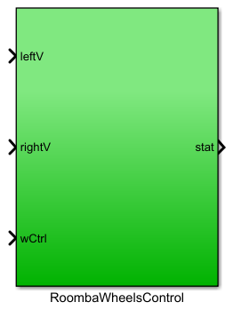
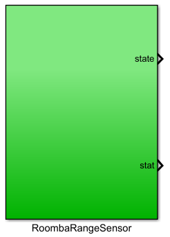

# iRobotAsimov
iRobot Roomba Controls Development

This project aims to provide an easy to use simulink library for the purpose of controlling the iRobot Create® 2 Programmable Robot. 

Currently the roombaLibrary.slx library contains four blocks. It relies on the "Matlab Toolbox for the iRobot Create 2" version 1.0 created by Professor Joel M. Esposito of the Systems Engineering Department of United States Naval Academy in Annapolis, Maryland.

Wheel Controls block:

The wCtrl input takes either a '0' or '1'. A '0' means no input to the wheels. A '1' calls the function SetWheelVelRoomba() function which take as input values in the range of '-0.5' to '0.5' for each wheel. '0.5' is the maximum forward velocity, '0' is stop, and '-0.5' is maximum reverse velocity. The 'stat' output can be connected to a display to see the current status of the state flow.

RoombaRangeSensor block:

The block calls the RangeStateRoomba() function which grabs the six sensor values and placed it in a 1x6 matrix. The sensor values will either be a '1' for object in range, or a '0' for no object in range. These values can be used for the purpose of collision avoidance.

Installation:
1) In Matlab, click on the Home tab, then click on "Addons". This will open up the Add-On Explorer window. Type 'roomba' into the search bar and then click on "Matlab Toolbox for the iRobot Create 2" in the results. Click 'Add' to download and add to path.

2) Navigate to the simulink folder on Github and download 'roombaCtrl.slx' and 'RoombaWiFiInit.m'.

3) Add the downloaded files to path by going to the 'Home' tab in Matlab, and click on 'Set Path'. Next, click on 'Add Folder' and then navigate to the folder containing the downloaded files. Click 'Select Folder' and the click on 'Save'. It may be necessary to restart Matlab.

4) Purchase and install the RooWiFi WiFi Module for Roomba to interface with the Roomba.

5) Purchase and install a USB WiFi adapter.

6) Connect to the RooWiFi module through the WiFi adapter.

7) Start Matlab/Simulink. Start a blank Simulink work space and relevant blocks.

You may also download roombaSensorsExample.slx and roombaSensorsExample.slx to test your roomba sensors and wheels.
