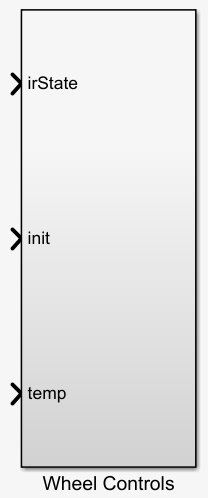

# iRobotAsimov
iRobot Roomba Controls Development

This project aims to provide an easy to use simulink library for the purpose of controlling the iRobot Create® 2 Programmable Robot. 

Currently the roombaLibrary.slx library contains four blocks. It relies on the "Matlab Toolbox for the iRobot Create 2" version 1.0 created by Professor Joel M. Esposito of the Systems Engineering Department of United States Naval Academy in Annapolis, Maryland.

Initialization block:

This block calls the RoombaWifiInit() function which connects to the RooWiFi module and initializes the Roomba in 'full' mode. Then, it sends a binary '1' to the output which will be used by other blocks as a signal to start execution.

IR Sensors block:

This block activates once it receives a binary '1' as input. It calls the RangeStateRoomba() function which grabs the six sensor values and placed it in a 1x6 matrix as output. The sensor values will either be a '1' for object in range, or a '0' for no object in range. These values can be used for the purpose of collision avoidance.

Wheel Controls block:

This block activates once it receives a binary '1' as input. It also takes input from the IR Sensors block and the Temerature block to be used for collision avoidance and emergency stop, respectively. It calls the SetWheelVelRoomba() function which take as input values in the range of '-0.5' to '0.5' for each wheel. '0.5' is the maximum forward velocity, '0' is stop, and '-0.5' is maximum reverse velocity. Depending on the irState input, the state flow will send different values to control the wheel velocities. Also, if the temperature input in above a set value, the roomba will stop.

Temperature block:

This block activates once it receives a binary '1' as input. It calls the TemperatureRoomba() function which returns the battery temperature in Celsius. This value will can be fed into the Wheel Controls block to trigger the emergency stop subroutine.

Installation:
1) In Matlab, click on the Home tab, then click on "Addons". This will open up the Add-On Explorer window. Type 'roomba' into the search bar and then click on "Matlab Toolbox for the iRobot Create 2" in the results. Click 'Add' to download and add to path.

2) Navigate to the simulink folder on Github and download the contents of the 'simulink folder'

3) Add the downloaded files to path by going to the 'Home' tab in Matlab, and click on 'Set Path'. Next, click on 'Add Folder' and then navigate to the folder containing the downloaded files. Click 'Select Folder' and the click on 'Save'. It may be necessary to restart Matlab.

4) Purchase and install the RooWiFi WiFi Module for Roomba to interface with the Roomba.

5) Purchase and install a USB WiFi adapter.

6) Connect to the RooWiFi module through the WiFi adapter.

7) Start Matlab/Simulink. Start a blank Simulink work space and relevant blocks.

8) Run the 'proj2Ex.slx' file to see an exmple of Roomba control.

Optional: You can download and add to path the 'Real-Time Pacer' library add-on so you can see the state flow running in real time.

# Collision Avoidance Algorithm:

Background: The iRobot Create® 2 robot come equipped with six IR sensors spread out in a 180 degree configuration on the front half of the Roomba. From left to right, we will name them sensors 1 to 6.

1) Reverse for 1 second.

2) Go forward until irState contains '1' for any sensor

3) If sensor 1 detects an obstacle, the Roomba turns right at speed level 1. Higher level equals faster speed, which means greater angle of turn.

4) If sensor 2 detects an obstacle, the Roomba turns right at speed level 2.

5) If sensor 3 detects an obstacle, the Roomba turns right at speed level 3.

6) If sensor 4 detects an obstacle, the Roomba turns left at speed level 3.

7) If sensor 5 detects an obstacle, the Roomba turns left at speed level 2.

8) If sensor 6 detects an obstacle, the Roomba turns left at speed level 1.

9) If the temp value from the Temperature block is greater than or equal to 75 degrees Celsius, the Roomba will stop all Wheel movement in order to lessen the load on the battery. Once the battery as cooled down below the threshhold, it will resume operations.
